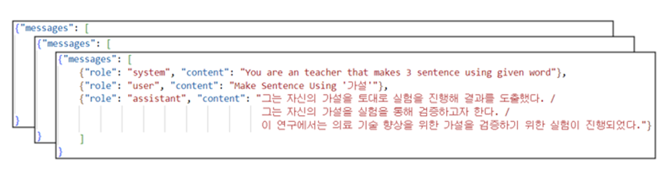
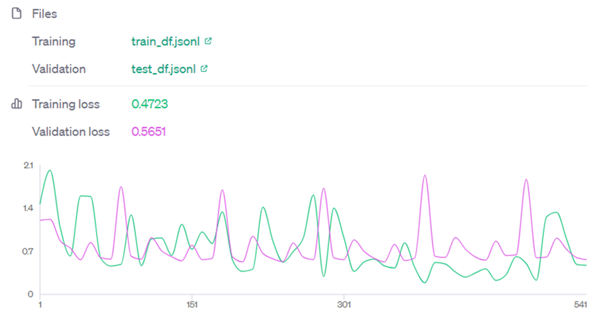
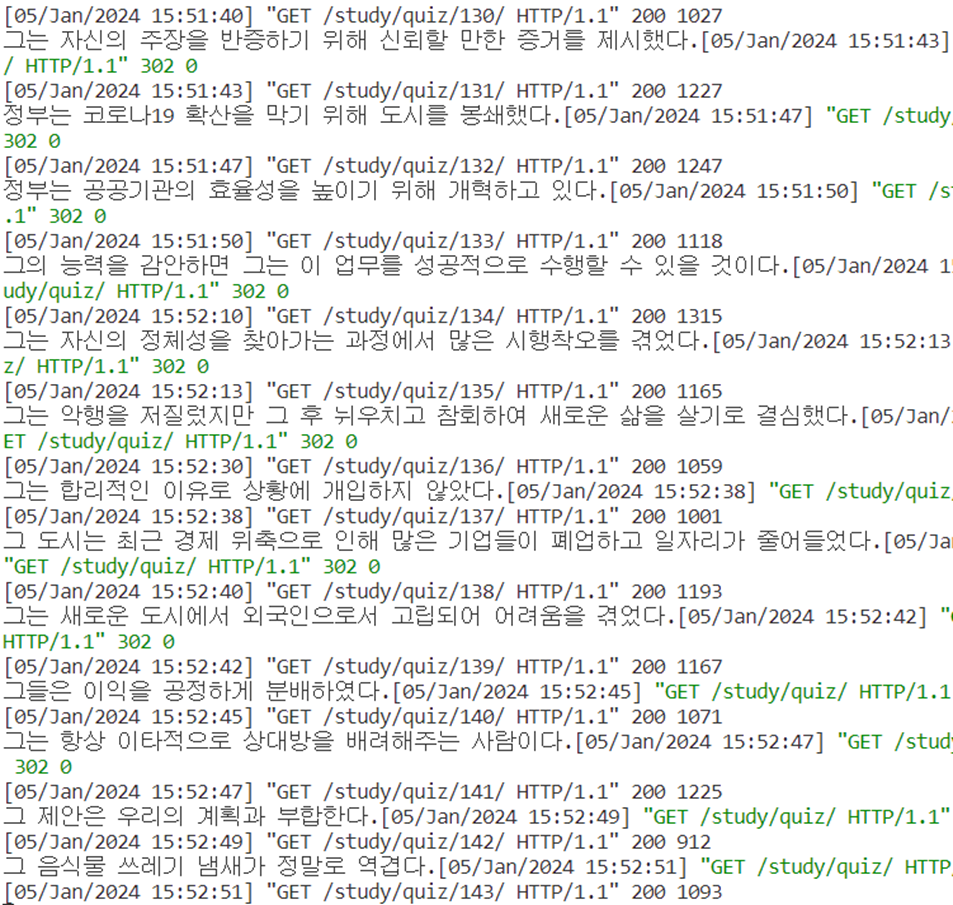
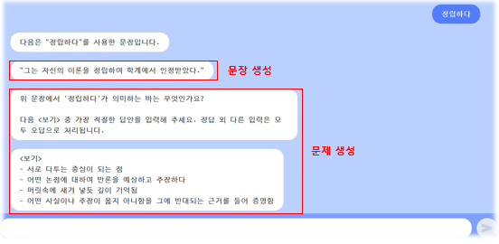
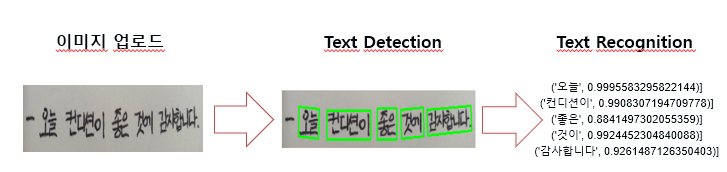
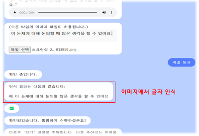
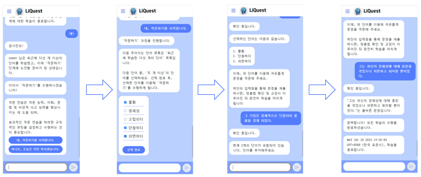

# 생성형 AI를 활용한 문해력 향상 플랫폼

## 프로젝트 선정배경

(2020. 9. 1.~2021. 8. 31.) 초·중·고교 학생의 경우에는 **연간 종합 독서율은 91.4%, 연간 종합 독서량 34.4권으로, ’19년과 비교하면 독서율은 0.7% 포인트, 독서량은 6.6권 감소했다.** 이러한 통계에 따르면 어린이들의 연간 독서량이 감소하고 있는 추세가 나타났다. 더욱이 디지털 미디어 환경의 부정적인 영향으로 인해 아이들의 문해력이 감소하고 있다고 보도되고 있다, 이는 어린이들의 학문적 성취와 사회 참여에 부정적인 영향을 미칠 수 있기 때문에 사회적으로 중요한 문제로 주목 받고 있다.

본 팀은 이러한 문제에 대응하여 어린이들의 문해력 향상과 독서에 대한 흥미 증진을 위해 재미, 성취감, 협동심을 통해 동기를 부여하고 지속적인 공부를 유도하는 서비스를 개발하고자 한다.

## 핵심 기능
- **단어 퀴즈**
    - **생성형 AI를 활용하여 특정 단어가 들어간 문장을 생성**
    - 해당 단어가 생성된 문장 내에서 어떤 의미로 사용 되었는지를 묻는 퀴즈
- **단어 연습장**
    - **생성형 AI를 활용하여 특정 단어가 들어간 문장을 생성**
    - 해당 단어가 들어간 문장에 대해 "읽기"와 "쓰기"를 진행하여,
    다양한 단어 용례를 통해 문해력 향상 가능
- **작문 하기**
    - **이전에 배웠던 단어를 직접 활용해보는 경험 제시**
    - 이전에 배웠던 단어 중 2개 이상을 골라 문장을 직접 작성해 보기
      
## 프로그램 구조 설명
### AI 모듈은 Study 파일에 존재함
    - gpt.py : 프롬프트 엔지니어링(Few Shot)을 활용하여 문장 생성 및 문제 생성
    - new_gpt.py : 파인튜닝 모델을 활용하여 문장 생성 및 문제 생성
        - 실제 프로젝트에서 사용한 모델 : ft:gpt-3.5-turbo-1106:personal::8aztbxTn
    - spell_correct.py : 작문하기 기능에서 맞춤법 검사 모듈
    - text_speech.py : Whisper-Large v2 사용 모델 및 코사인 유사도를 활용한 채점 모듈
    - views.py : AI 각 모듈에 대한 API 모듈과 Paddle OCR을 활용한 OCR 모듈
 
## 기술 스택 및 아키텍쳐
- FrontEnd : **React**
- BackEnd : **Django RestFramework, OAuth(네이버, 카카오)**
- AI : **OpenAI API, Langchain, Paddle OCR, Whisper, GTTs**

## 핵심 구현 내용
- **프롬프트 엔지니어링**
    - 초기에는 프롬프트 엔지니어링을 통해 문장을 생성 ⇒ 이후 Langchain을 통해 Json 포멧으로 변환
    - 프롬프트 엔지니어링(문장생성)
    - 프롬프트 엔지니어링(문제생성)
    - Langchain을 활용해 포맷 변경
      
- **파인 튜닝**
    - 프롬프트 엔지니어링의 경우에 특정 단어를 잘못 사용된 예시를 반환하거나, 포맷에 맞게 생성하지 못하는 문제 발생 ⇒ 파인 튜닝을 통해 위 문제 해결
    - 파인튜닝(문장 생성)
    - 사용된 모델 : GPT-3.5-Turbo-1106 모델을 사용함
        - 이유 : GPT-4.0에 비해 정확도는 떨어질 수 있으나 생성 속도가 빠르기 때문에
        - 참고자료 : https://aider.chat/docs/benchmarks-speed-1106.html
          
    - 데이터 셋 구성
          - 
      
    - 파인튜닝 결과
        - Train : loss = 0.4723, accuracy = 0.8532
        - Validation : loss = 0.5651, accuracy = 0.5955
            - 
          
    - 실제 문장 생성 결과
        - 
      
    - 실제 적용 페이지
        - 
      
- **Paddle OCR을 활용한 OCR 모듈 구현**
    - 실제로 한국어에 대해서는 Clova X의 OCR이 정확했지만, 비용적인 측면이나 이후 파인튜닝이 가능하다는 점에서 Paddle OCR을 통해 구현하기로 결정
    - 모듈 수행 과정
        - 
    - 실제 적용 페이지
        - 

- **Whisper를 활용한 STT 모듈 구현**
    - 다른 STT 모듈에 비해 비교적 정확한 성능을 가지고 있음
    - 사용한 모델 : Whisper Large-v2 모델
    - 실제 Whisper 에서 발표한 성능 지표**(약 6.5% 단어 오류율) => ** https://raw.githubusercontent.com/openai/whisper/main/language-breakdown.svg 참고
    - 실제 적용 페이지
        - 

- **맞춤법 검사 모듈**
    - **맞춤법 검사 모듈은 계획 상으로는 hanspell-py를 사용하여 구현하려고 했으나, 네이버 맞춤법 API 비공개 및 passbook key의 지속적인 갱신 문제로 인해 사용 불가 판정**
    - HuggingFace의 한국어 맞춤법 교정 모델을 사용하여 구현
        - 참고 : https://huggingface.co/Soyoung97/gec_kr/blob/main/README.md?code=true
        - **단, 해당 모델에서 사용된 데이터셋은 상업적으로 사용 불가하다 함**
            ⇒ 다른 맞춤법 수정 모듈(부산대 맞춤법 수정 등)도 상업적 이용은 불가하다 적혀있음
            ⇒ 실제 상업적으로 이용할 때에는 직접 데이터셋을 만들어 구현해야 함
            
    - 실제 적용 페이지
        - 

