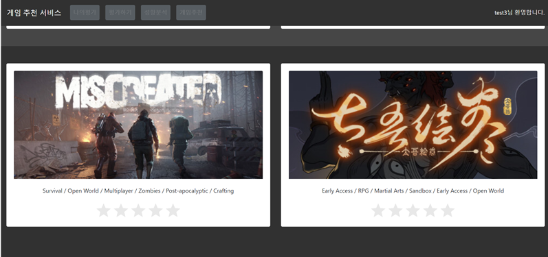
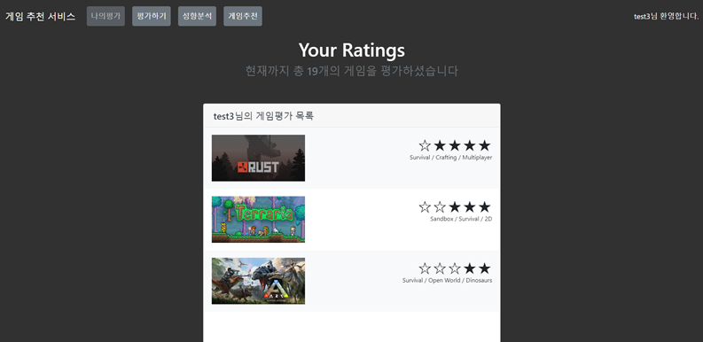
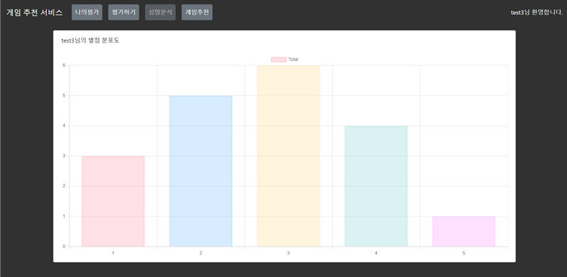
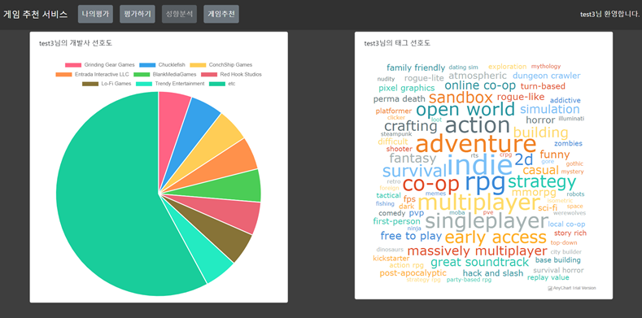
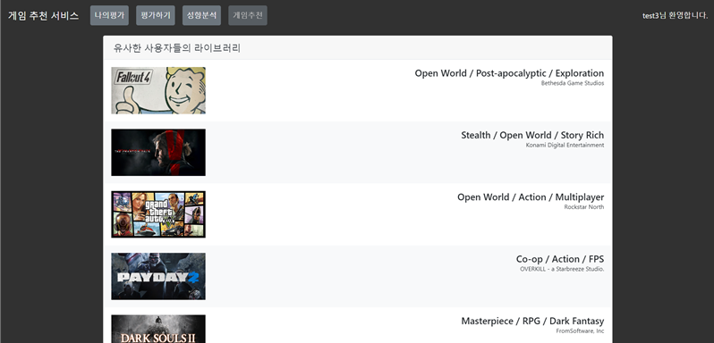
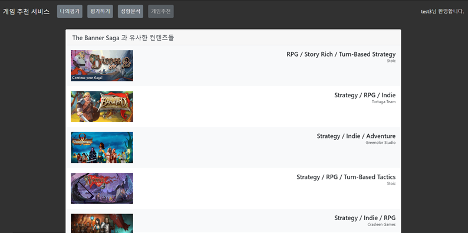
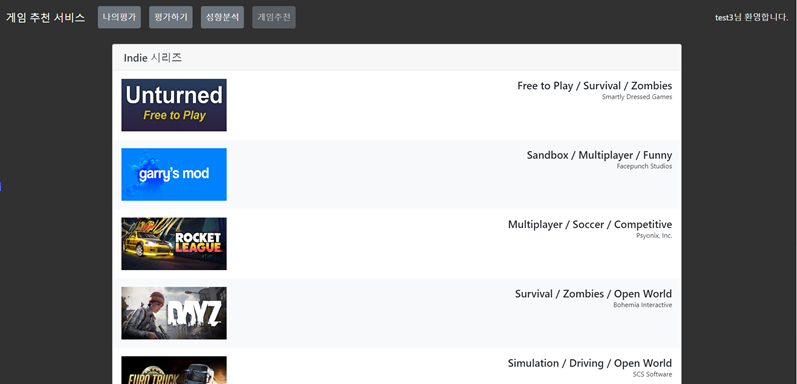

# 게임 추천 시스템

## 프로젝트 정의

- 본 프로젝트는 사용자가 입력한 데이터를 바탕으로 사용자의 게임 성향을 분석하고, 분석 결과를 토대로 사용자의 성향에 맞는 게임을 추천해주는 웹 프로그램이다.
- 본 프로그램을 통해 사용자는 자신의 게임 성향 및 현재 라이브러리 게임에 관한 정보들을 한눈에 파악할 수 있으며, 이를 바탕으로 진행한 머신러닝을 통해 사용자가 관심을 가질 만한 게임을 추천해주는 기능을 제공한다.

## 핵심 기능

- **게임 별점 입력 및 확인**
  - 사용자가 자신이 플레이했던 게임들의 별점을 입력하고 확인할 수 있음
- **성향 분석 결과**
  - 게임들의 스팀 태그, 개발사 등을 분석하고, 결과를 시각화하여 제공함
- **게임 추천**
  - 분석한 결과를 바탕으로 사용자 기반, 아이템 기반, 성향 분석 결과를 기반으로 게임 추천을 진행함

## 파일 구성도

- **analysis**
  - 로그인 사용자 게임 별점 입력
  - 로그인 사용자 게임 별점 확인
  - 로그인 사용자 개인 성향 파악
  - 로그인 사용자 게임 추천(협업필터링, 아이템 기반 추천)
- **common** : 로그인 모듈
- **recommend** : 게임 추천 모듈
  - 비로그인 사용자 초기 태그 선택
  - 태그와 관련된 게임 보여주기
  - 사용자 게임 선택
  - 게임 추천 모듈(협업필터링, 아이템 기반 추천)

## 시스템 구성도

## 구현내용

### 게임 별점 입력

- **초기 사용자 또는 태그 선택을 통한 별점 입력**

  - 처음에 총 6가지의 태그 중에서 2개를 입력받음
  - 입력 받은 태그가 있는 게임들을 추출하여 인기 순으로 정렬하여 표시함
  - 이 중에서 사용자가 플레이 한 게임에 별점을 표시함
  - 입력한 별점을 바탕으로 SVD 알고리즘(협업 필터링)을 통해 추천 진행

- **이후 사용자들의 지속적인 게임 별점 입력 모듈 구현**
  - 이전에 추천받았던 게임들을 데이터베이스에서 불러와 게임 추천 진행
    
- **사용자의 평가한 게임 별점 확인**
  

### 성향 분석 시각화

- 사용자가 평가한 게임들을 바탕으로 성향 분석 후 시각화 진행
  
  

### 게임추천

- 협업 필터링을 활용한 게임 추천
  

- 가장 선호하는 게임과 유사한 게임 추천
  

- 가장 선호하는 태그와 유사한 게임 추천
  

### 협업 필터링 알고리즘 성능(데이터 100,000개 기준)

### 사용한 기술스택

- Data Processing : Anaconda, Python Surprise, Numpy, Pandas, SQLite3
- Web Programming : Django, Bootstrap
- Visualizing : Chart JS, JQCloud JS

### 사용한 데이터 셋 및 API

- SteamWorks API : https://partner.steamgames.com/doc/webapi/ISteamApps#GetAppList
- Kaggle(game_ratings) : https://www.kaggle.com/datasets/tamber/steam-video-games
- Kaggle(game_info) : https://www.kaggle.com/datasets/trolukovich/steam-games-complete-dataset
