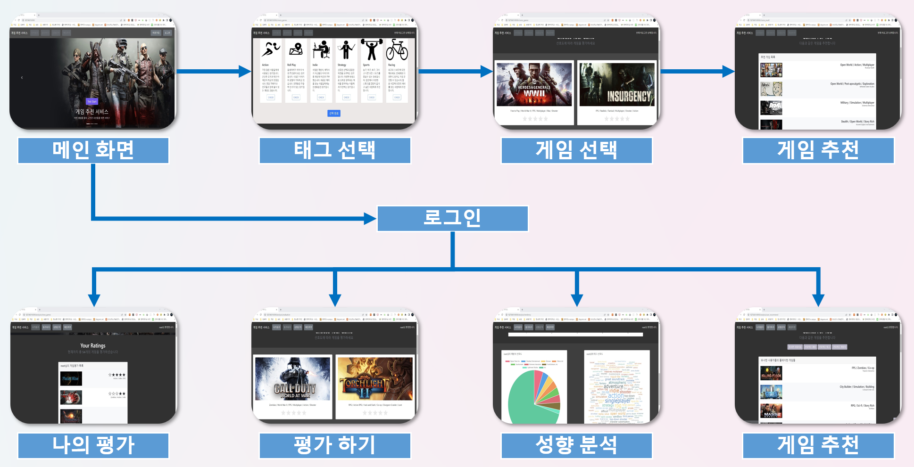
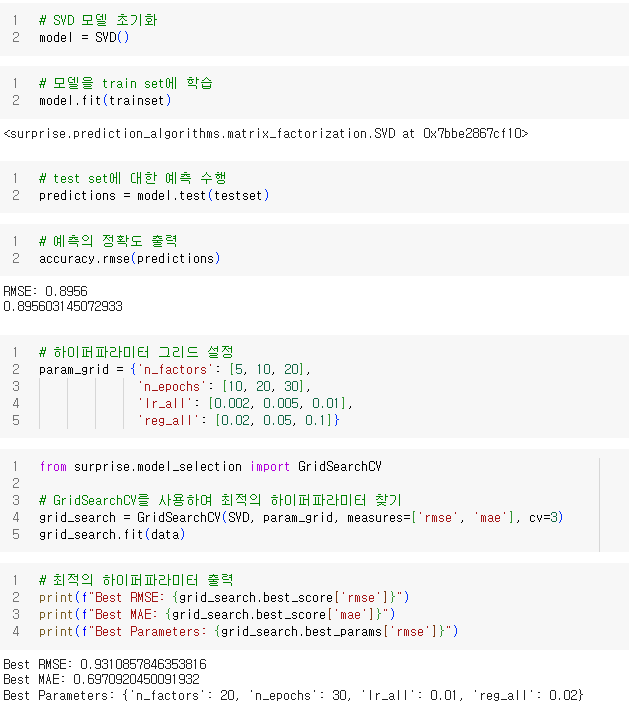

# Game_Recommend_System

## 파일 구성도

- analysis
  - 로그인 사용자 게임 별점 입력
  - 로그인 사용자 게임 별점 확인
  - 로그인 사용자 개인 성향 파악
  - 로그인 사용자 게임 추천(협업필터링, 아이템 기반 추천)
- common : 로그인 모듈
- recommend : 게임 추천 모듈
  - 비로그인 사용자 초기 태그 선택
  - 태그와 관련된 게임 보여주기
  - 사용자 게임 선택
  - 게임 추천 모듈(협업필터링, 아이템 기반 추천)
  
## 시스템 구성도

### 협업 필터링 알고리즘 성능(데이터 100,000개 기준)

### 사용한 기술스택

- Data Processing : Anaconda, Python Surprise, Numpy, Pandas, SQLite3
- Web Programming : Django, Bootstrap
- Visualizing : Chart JS, JQCloud JS

### 사용한 데이터 셋 및 API

- SteamWorks API : https://partner.steamgames.com/doc/webapi/ISteamApps#GetAppList
- Kaggle(game_ratings) : https://www.kaggle.com/datasets/tamber/steam-video-games
- Kaggle(game_info) : https://www.kaggle.com/datasets/trolukovich/steam-games-complete-dataset

